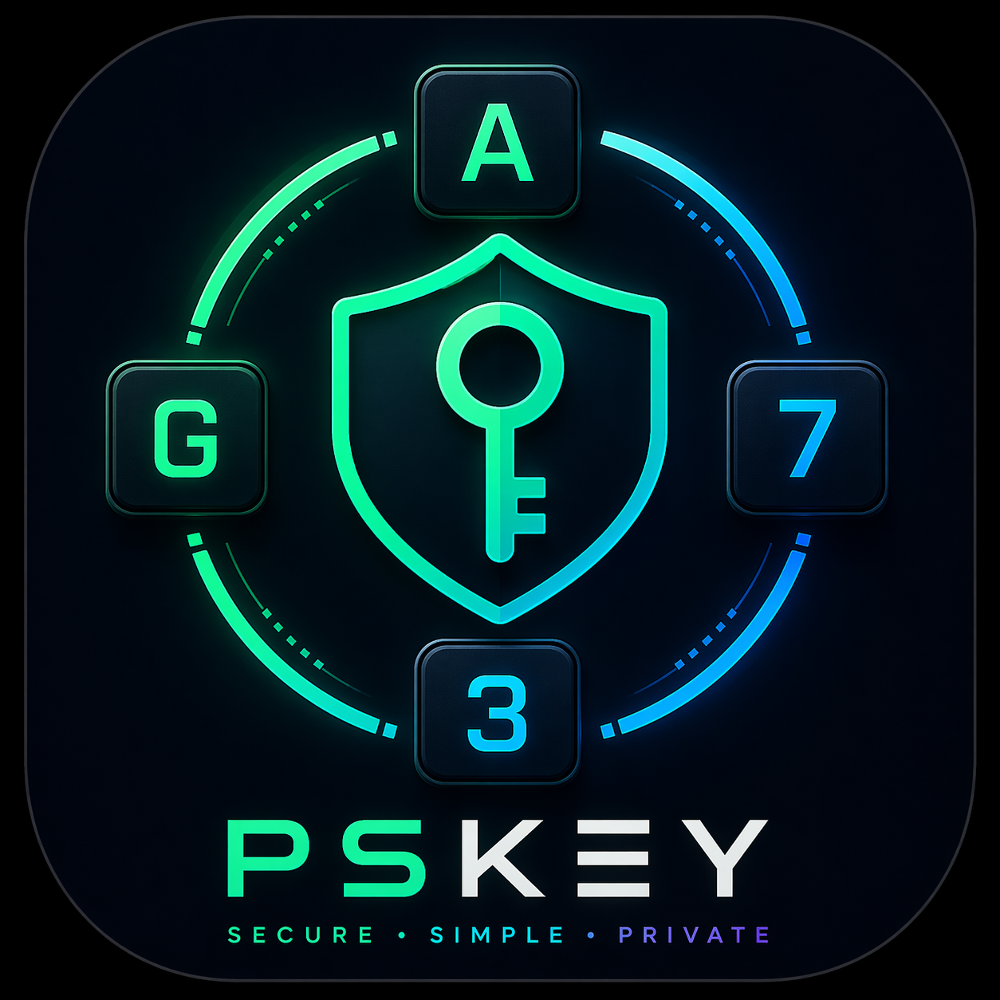

<div align="center">



# 🔐 PSKey

**A tiny, transparent, always-on-top password manager widget.**
Built with [Tauri](https://tauri.app) + [React](https://react.dev) + [libsodium](https://doc.libsodium.org).

<br />

[](LICENSE)
[](https://tauri.app)
[](https://react.dev)
[](https://www.typescriptlang.org)
[](https://www.rust-lang.org)
[](https://doc.libsodium.org)
[](https://en.wikipedia.org/wiki/Argon2)
[](CONTRIBUTING.md)
[](#)
[](#)

<sub>145 px wide · transparent · draggable · autolocks on blur · challenge-response unlock</sub>

</div>

---

## ✨ Highlights

- 🪟 **Tiny widget** — 145 px transparent floating window; drag it anywhere.
- 🔒 **Libsodium all the way down** — Argon2id + XSalsa20-Poly1305, nothing handrolled.
- 🎭 **Challenge-response PIN** — the PIN you memorize is *never* what you type.
- ⚡ **Async crypto** — every Argon2id call (unlock, add-entry, reveal, rekey)
  runs off the UI thread, with a cheeky "Cooking…" indicator.
- 🧊 **Autolock everywhere** — 30 s sliding session + instant lock on window blur.
- 📋 **Self-wiping clipboard** — copied secrets are cleared after 15 s.
- 🚫 **Persistent lockout** — escalating cooldowns (1 m → 24 h cap) survive
  process kill and reboot; first lockout costs 10 attempts, every one after
  that costs only 3.
- 🎨 **Themes & UI scale** — 5 dark variants and 6 zoom levels, persisted in
  `settings.json` (auto-generated with sane defaults).
- 🔑 **Rekey on demand** — change PIN and/or KDF strength
  (Interactive / Moderate / Sensitive) without re-entering data.
- 🧱 **Hardened capabilities** — strict CSP, minimal Tauri permissions.

## 🔐 Security model

| Layer               | What                                                                |
| ------------------- | ------------------------------------------------------------------- |
| Vault file          | `$APP_DATA/vault.bin`, atomic write with `.bak` rotation            |
| KDF                 | Argon2id via libsodium `crypto_pwhash`, strength selectable per vault (Interactive ≈ 64 MiB, Moderate ≈ 256 MiB, Sensitive ≈ 1 GiB) |
| Cipher              | XSalsa20-Poly1305 (libsodium `secretbox`)                           |
| Plaintext           | msgpack-encoded `VaultData`, zeroized on drop                       |
| Per-entry PIN       | separate Argon2id salt + 32-byte hash, constant-time compare        |
| Session             | 30 s sliding TTL, opaque 24-byte token held in Rust state only      |
| Clipboard           | copy performed in Rust, auto-cleared after 15 s if unchanged        |
| Rate limit          | persistent escalating lockout: 10 attempts → 1 m, 3 m, 5 m, 10 m, 15 m, 30 m, 1 h, 3 h, 12 h, 24 h cap; only **3** attempts between lockouts; resets on success |
| Autolock            | on window blur and on session expiry                                |
| Front-end surface   | strict CSP, no remote assets, minimal Tauri capabilities            |

## 🧩 Challenge-response unlock

To protect the PIN against keyloggers and shoulder-surfing, PSKey uses a
rotating 4-character **challenge** shown above the OTP input. You never type
your raw PIN — you type a **response** computed per slot from your memorized
PIN and the current challenge.

```text
  ┌───┐ ┌───┐ ┌───┐ ┌───┐
  │ 2 │ │ 9 │ │ I │ │ X │   ← challenge (rotates every 30s)
  └───┘ └───┘ └───┘ └───┘
      PIN in your head: 4 1 8 7
  ┌───┐ ┌───┐ ┌───┐ ┌───┐
  │ 6 │ │ A │ │ I │ │ X │   ← what you actually type
  └───┘ └───┘ └───┘ └───┘
```

- **Alphabet**: digits `0-9` and uppercase letters `A-Z`.
- **Challenge rotation**: every 30 seconds.
- **Layout**: 4 slots; 3 digits + 1 letter at a random position (keeps backend
  brute-force over the masked slot bounded to ≤ 10 Argon2 tries).

### Per-slot rule

For each slot *i* (1..4), given `challenge[i]` and the user's memorized
`pin_digit[i]` (0-9):

| `challenge[i]` | Response to type                      | Notes                             |
| -------------- | ------------------------------------- | --------------------------------- |
| digit `0-9`    | `base19(pin_digit[i] + challenge[i])` | sum is in `0..=18`                |
| letter `A-Z`   | `challenge[i]` itself                 | PIN digit at this slot is masked  |

**Base-19 alphabet**: `0-9` → values 0-9, `A-I` → values 10-18.

### Examples

| challenge | pin | response | explanation                                        |
| --------- | --- | -------- | -------------------------------------------------- |
| `9`       | `9` | `I`      | `9 + 9 = 18 → I`                                   |
| `1`       | `9` | `A`      | `1 + 9 = 10 → A`                                   |
| `2`       | `4` | `6`      | `2 + 4 = 6`                                        |
| `I`       | `1` | `I`      | letter challenge → type the letter                 |
| `X`       | `9` | `X`      | letter challenge → PIN digit ignored for this slot |

Walk-through — challenge `"29IX"`, PIN `"4187"`:

- slot 1: `'2' + 4 = 6`  → `6`
- slot 2: `'9' + 1 = 10` → `A`
- slot 3: letter `'I'`   → `I`
- slot 4: letter `'X'`   → `X`

You type **`6AIX`** into the OTP. ✅

### Verification (backend)

The frontend sends `(challenge, response)` to `vault_unlock_challenge`. The
Rust backend:

1. Rejects any challenge containing more than 1 letter.
2. For each digit-challenge slot, recovers
   `pin_digit = (base19(response) − challenge) mod 19` and rejects anything
   outside `0..=9`.
3. For each letter-challenge slot, requires `response[i] == challenge[i]`
   (case-insensitive) and enumerates the 10 possible PIN digits.
4. Tries each candidate PIN (≤ 10 with the 1-letter cap) against the Argon2id
   vault key. On success, opens the session. Otherwise a **single** attempt is
   counted against the rate limiter, regardless of how many candidates were
   tried.

## � App data layout

Everything PSKey writes lives under your platform's `$APP_DATA/com.fanaperana.pskey/`:

| File           | Purpose                                                                | Encrypted?       |
| -------------- | ---------------------------------------------------------------------- | ---------------- |
| `vault.bin`    | secrets — header (KDF params + nonce) followed by `secretbox` blob     | yes              |
| `settings.json`| theme, UI scale, default KDF strength for new vaults                   | no (no secrets)  |
| `lockout.json` | failed-attempt counter, current lockout level, cooldown deadline       | no (counters)    |

`settings.json` and `lockout.json` are auto-created with safe defaults on
first launch and written atomically (`*.tmp` → rename).

## �🚀 Getting started

```sh
pnpm install
pnpm tauri dev
```

Requirements:

- Node 20+ and pnpm
- Rust stable toolchain
- Tauri v2 prerequisites — <https://v2.tauri.app/start/prerequisites/>

### Build

```sh
pnpm tauri build
```

## 🧪 Checks

```sh
npx tsc --noEmit              # TypeScript
cd src-tauri && cargo check   # Rust
```

## 🗺️ Roadmap

- [ ] Linux / Windows packaging + icons
- [ ] Optional auto-update channel
- [ ] Import / export (encrypted)
- [ ] Tests for the vault format + challenge decoder
- [ ] Accessibility pass on the tiny widget UI

## 🐞 Troubleshooting

**`libpthread.so.0: undefined symbol: __libc_pthread_init` on Linux.**
This happens when WebKitGTK is launched from a Snap-installed VS Code: the
Snap leaks `GTK_PATH` / `XDG_DATA_DIRS` pointing into `/snap/...` which
load an incompatible glibc. Run `pnpm tauri dev` from a regular terminal
(or install VS Code from `.deb` / Flatpak / the official repo). If you must
launch from Snap, prefix the command with:

```sh
env -u GTK_PATH -u GTK_EXE_PREFIX -u GIO_MODULE_DIR -u GTK_IM_MODULE_FILE \
    -u XDG_DATA_DIRS -u XDG_DATA_HOME pnpm tauri dev
```

Open to ideas — see [CONTRIBUTING.md](CONTRIBUTING.md).

## 🤝 Contributing

PRs welcome. Please read [CONTRIBUTING.md](CONTRIBUTING.md) and the
[Code of Conduct](CODE_OF_CONDUCT.md) before opening a PR. Security issues?
Report them privately via [SECURITY.md](SECURITY.md).

## 🧰 Recommended IDE Setup

- [VS Code](https://code.visualstudio.com/)
  + [Tauri](https://marketplace.visualstudio.com/items?itemName=tauri-apps.tauri-vscode)
  + [rust-analyzer](https://marketplace.visualstudio.com/items?itemName=rust-lang.rust-analyzer)

## 📜 License

[MIT](LICENSE) © 2026 Fanaperana
